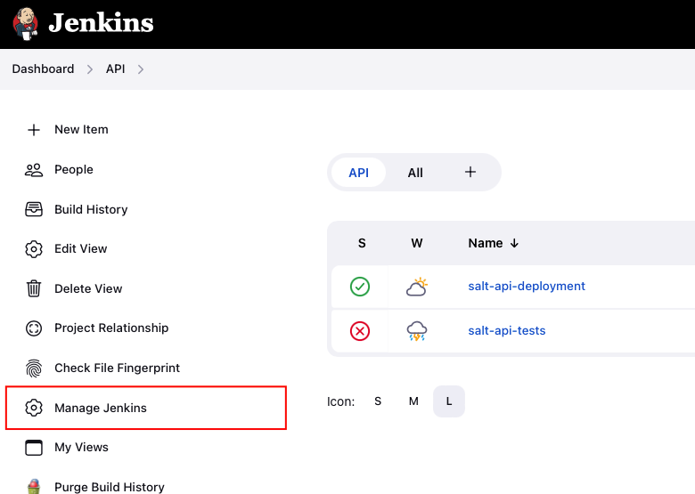
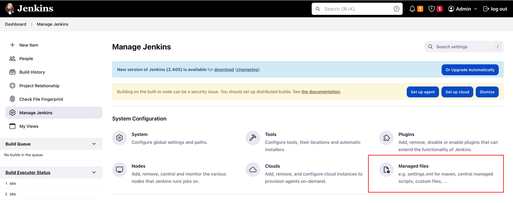

# finder-chart-generator

Website for generating SALT finder charts

## Deployment

You can deploy the Finder Chart Generator as a Docker container to a development or a production server with the provided Jenkins pipeline files. The deployment includes building a Docker image, which is pushed to a Docker registy.

### Prerequisites

Before you can run the pipeline scripts for deployment, a few requirements must be fulfilled:

* The [SAAO Shared Library](https://github.com/saltastroops/saao-shared-jenkins-library) and all its requirements must be installed. See its documentation for instructions.
* The [Config File Provider](https://plugins.jenkins.io/config-file-provider/) and [Pipeline Utility Steps](https://plugins.jenkins.io/pipeline-utility-steps/) plugins must be installed.
* You need credentials for the container registry and the deployment server, as well as a configuration file as explained in the next section.

### Configuration

The deployment is configured in a configuration file. To create such a file, go to the Jenkins dashboard and select the "Manage Jenkins" option from the sidebar menu.



Then select the "Managed files" option.



Finally, add the configuration as a JSON file and save your changes.

The configuration file for the development server must be called `finder-chart-dev` and must have the following properties.

| Property | Explanation                                               | Example value            |
|---|-----------------------------------------------------------|--------------------------|
| host | The deployment server.                                    | server.example.com       |
| hostCredentialsId | The id of the credentials for the deployment server. | server-credentials       |
| registryCredentialsId | The id of the container registry credentials (see below). | registry-credentials     |
| registryUrl | URL of the container registry.                            | https://registry.example.com |

An example configuration might look as follows.

```json
{
  "host": "dev.example.com",
  "hostCredentialsId": "server-credentials",
  "registryCredentialsId": "registry-credentials",
  "registryUrl": "https://registry.example.com"
}
```

As noted above, two credentials are required.

1. Credentials of the type "Username and password" must be defined with the username and password for the container registry.
2. Credentials of the type "SSH username with private key". The username must be that for the deployment server, and the key must be the private key of the Jenkins user. The Jenkins server must be included in the `authorized_hosts` file of the user on the deployment server.

To add these credentials, go to the Jenkins dashboard and click on the "Manage Jenkins" item in the sidebar menu.


Afterwards choose the "Credentials" option.


Add the credentials (and remember to save your changes).
